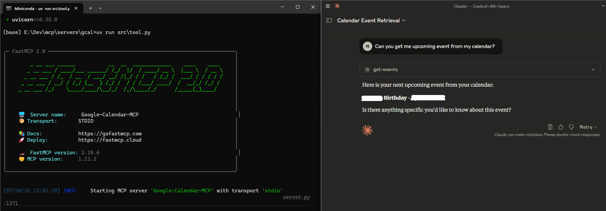
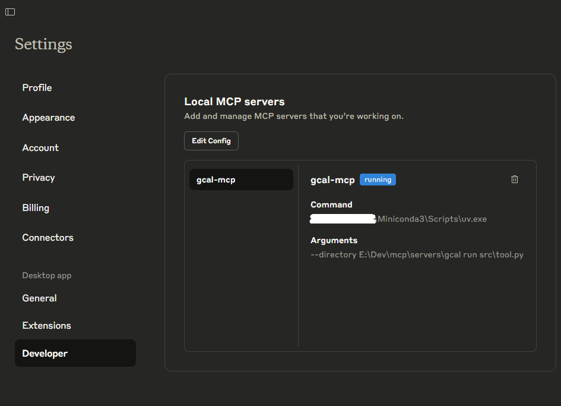

# Google Calendar Events MCP Server

Uses Google Calendar API method to fetch upcoming events only.

## Test output:



## Pre-requisites
Create an app on GCP and get client secret.
- Set up your Google Workspace project and Auth Platform by following [Google's documentation](https://developers.google.com/workspace/calendar/api/quickstart/python)
- Download the client secret JSON and keep in the repo base folder as `credentials.json`

### Run MCP Server

```cmd
uv venv
uv sync
uv run src/tool.py
```

### Add to Claude Desktop [Windows Setting]
Note: You must have it installed.

Open file in Notepad: __%USERPROFILE%\AppData\Roaming\Claude\claude_desktop_config.json__

Add the MCP server entry to the JSON:

```json
"gcal-mcp": {
    "command": <PATH TO uv.exe>,
    "args": [
        "--directory",
        <PATH TO THE MCP SERVER FOLDER>,
        "run",
        "src\\tool.py"
    ]
}
```

It may look like this finally:

```json
{
	"mcpServers": {
		"gcal-mcp": {
			"command": "%USERPROFILE%\\Miniconda3\\Scripts\\uv.exe",
			"args": [
				"--directory",
				"E:\\Dev\\mcp\\servers\\gcal",
				"run",
				"src\\tool.py"
			]
		}
	}
}
```

It should look like this in Claude Desktop



## Note
I use Miniconda. Hence the path to UV shows up this way. If you have different setup, you will have to figure out where is UV.exe installed.
<br>UV setup guide: https://docs.astral.sh/uv/getting-started/installation/
